# DevOps AI Agent — Full Project Specification

> **For Cursor :** Read this entire document before writing any code. Every architectural decision is intentional. Do not substitute libraries, change the folder structure, or simplify the approval gate without explicit instruction. Build phase by phase — each phase must be fully working before starting the next.

---

## 1. Project Overview

An autonomous DevOps AI agent built on the Model Context Protocol (MCP). Claude monitors real VPS servers, detects infrastructure issues, proposes fixes, and executes them autonomously — but pauses at a human-in-the-loop approval gate for anything risky.

The operator sees everything through a **web dashboard** (browser) and can also approve/reject via **Claude Desktop chat** as a fallback. Every action is logged, every rejection is stored as a rule, and Claude gets smarter about your specific infrastructure over time.

### What makes this different from a monitoring tool

- Claude **reasons** over signals — it does not just threshold-alert, it correlates a container crash with a recent GitHub Actions deploy and explains the connection
- Claude **executes fixes** autonomously after approval — not just suggests steps
- Claude **learns** from rejections — if you say "do not do this", it stores that rule permanently
- The entire system is **auditable** — every action, approval, and rejection is logged with timestamp and rationale

---

## 2. Infrastructure Context (do not change these assumptions)

| Property | Value |
|---|---|
| Servers | 1–3 VPS instances (DigitalOcean / Hetzner / Linode) |
| OS | Linux (Ubuntu 22.04 assumed) |
| Server access | SSH with private key only — no monitoring agent installed |
| Containerisation | Docker + docker-compose on each server |
| CI/CD | GitHub Actions |
| Approval channels | Web dashboard (primary) + Claude Desktop chat (fallback) |
| State store | SQLite (zero infrastructure — ships in repo) |
| Language | Python 3.11+ (backend) + React (dashboard) |

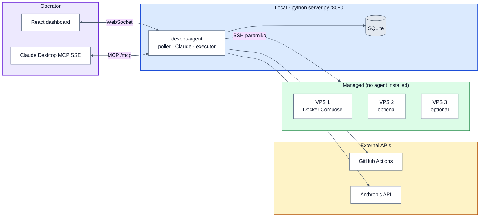

---

## 3. System Architecture

Single process on **`127.0.0.1:8080`**. Run `python server.py` to start FastAPI, WebSocket hub, MCP (SSE), the 30s poller, agent loop, and static dashboard build.

### 3.1 Deployment topology

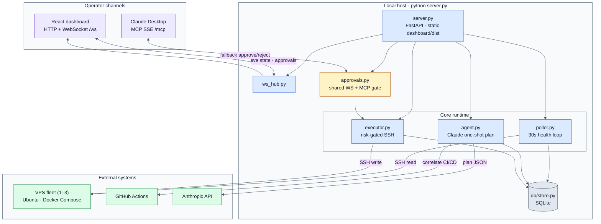

### 3.2 Layered architecture

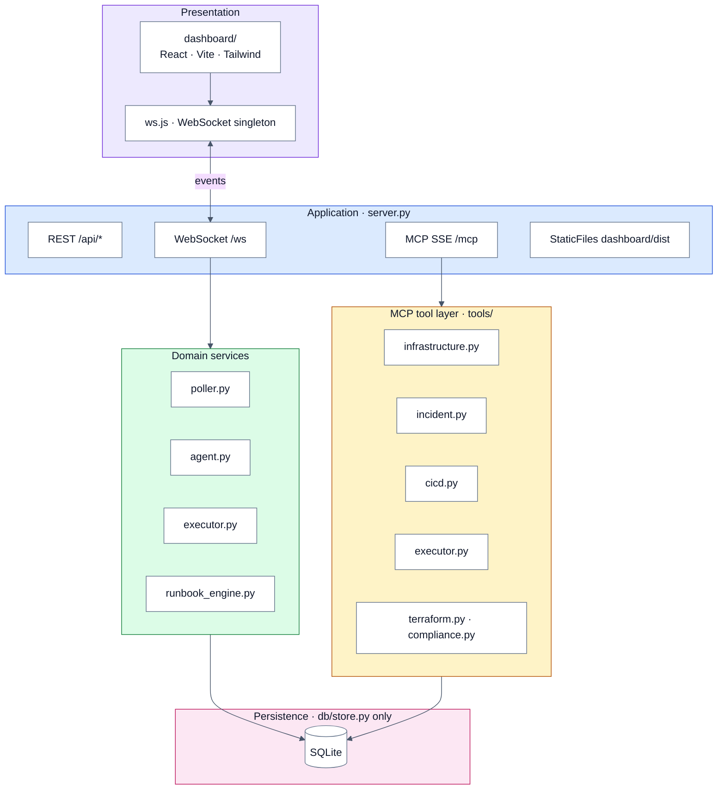

### 3.3 Component map

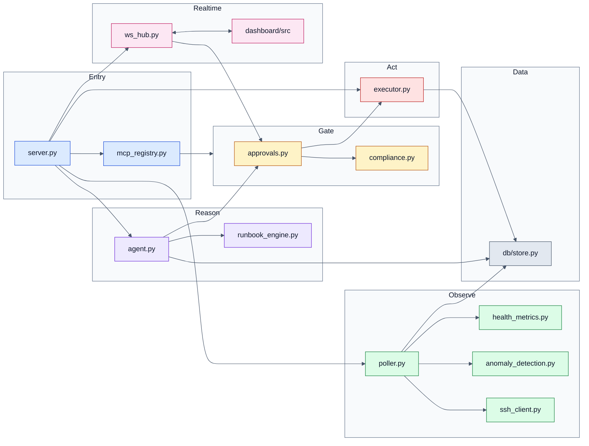

### 3.4 Approval & risk flow

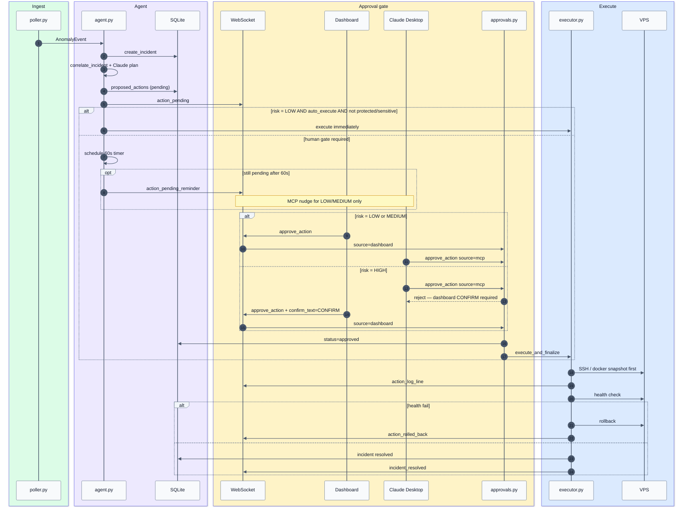

### 3.5 Risk tiers

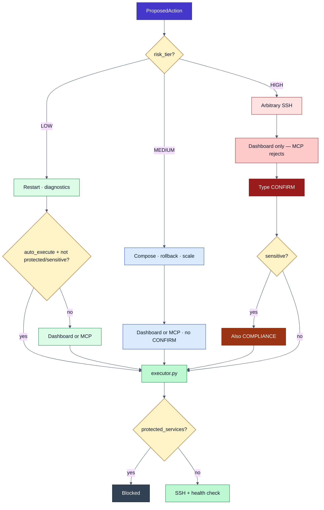

### Component responsibilities

**`server.py`** — Entry point. Starts FastAPI (serves dashboard static files + REST API + WebSocket), registers all MCP tools via `mcp_registry.py`, launches the poller as a background asyncio task. Single process, single command to start everything.

**`poller.py`** — Async loop running every 30 seconds. SSHes into each configured server, collects metrics (CPU, memory, disk, container statuses), compares to stored baseline, writes snapshot to SQLite. If anomaly detected, triggers the agent loop.

**`agent.py`** — The Claude reasoning loop. Receives anomaly context from poller. Pre-gathers context in Python; one-shot Claude JSON (no API tool loop). Produces a structured `ProposedAction`. Writes action to SQLite with `status=pending`. Pushes to dashboard via WebSocket. Schedules `action_pending_reminder` after 60s if still pending.

**`approvals.py`** — Shared approve/reject logic for WebSocket and MCP. **Rejects HIGH risk MCP approvals.** Dashboard HIGH requires typed `CONFIRM` (and `COMPLIANCE` for sensitive services).

**`executor.py`** — Risk-gated execution engine. Receives approved `ProposedAction`. Snapshots current state (for rollback). Executes via SSH. Streams live output back via WebSocket. Runs post-action health check. Rolls back on failure.

**`store.py`** — aiosqlite wrapper. All database access goes through this module. Never import aiosqlite directly in other files.

**`dashboard/`** — React SPA. Served as static files by FastAPI. Connects to WebSocket for real-time updates. Main views: Server Grid, Incident Feed, Approval Queue, Runbooks, Terraform (Phases 5–8).

---

## 4. Complete File Structure

```
devops-mcp/
├── server.py                    # Entry — FastAPI + MCP SSE + WebSocket + static
├── poller.py                    # 30s health loop
├── agent.py                     # Claude observe→plan→gate loop
├── executor.py                  # Risk-gated execution orchestration
├── approvals.py                 # Shared approve/reject (WS + MCP)
├── compliance.py                # Sensitive service + audit helpers
├── runbook_engine.py            # Runbook match + auto-exec (Phase 8)
├── mcp_registry.py              # MCP tool registration
├── ws_hub.py                    # WebSocket broadcast hub
├── ssh_client.py                # Pooled paramiko connections
├── health_metrics.py            # Metric parsing from SSH output
├── anomaly_detection.py         # Baseline/threshold anomaly logic
├── false_positive_handler.py    # Suppression + alert fatigue (Phase 8)
│
├── tools/
│   ├── infrastructure.py        # SSH + Docker read tools
│   ├── cicd.py                  # GitHub Actions tools
│   ├── incident.py              # Incidents, correlation, postmortem, handoff
│   ├── executor.py              # SSH write + docker-compose execution
│   ├── terraform.py             # Terraform plan analysis (Phase 8)
│   ├── compliance.py            # MCP compliance tools
│   └── false_positive.py        # False-positive MCP tools
│
├── db/
│   ├── schema.sql
│   └── store.py                 # ONLY module that touches SQLite
│
├── models/
│   ├── server.py
│   ├── incident.py
│   └── config.py
│
├── dashboard/                   # React SPA → dist/
│   └── src/
│       ├── ws.js
│       ├── components/          # ServerGrid, ApprovalCard, ExecutionLog, …
│       └── pages/               # Dashboard, Incidents, Runbooks, Terraform
│
├── config/
│   ├── servers.yaml             # gitignored — use .example
│   ├── rules.yaml
│   ├── repos.yaml
│   └── terraform_rules.yaml.example
│
├── tests/
├── docs/                        # DECISIONS, DEVELOPMENT_PLAN, phase plans
├── .env.example
├── pyproject.toml
├── README.md
├── Project.md                   # This specification
└── claude_desktop_config.json
```

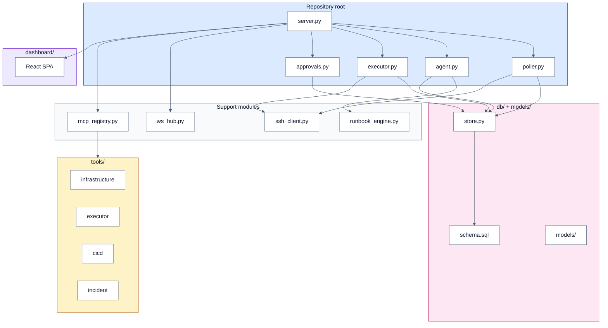

---

## 5. Configuration Files

### `config/servers.yaml`

```yaml
servers:
  - id: vps-01
    label: "Production"
    host: "your-server-ip-or-hostname"
    port: 22
    user: "ubuntu"
    ssh_key_path: "~/.ssh/id_ed25519"
    services:
      - name: api-service
        compose_file: "/opt/apps/api/docker-compose.yml"
        sensitive: false          # true = compliance flag at approval gate
      - name: db-service
        compose_file: "/opt/apps/api/docker-compose.yml"
        sensitive: true           # PHI/PII — extra warning at gate
    thresholds:
      cpu_percent: 80             # trigger anomaly above this
      memory_percent: 85
      disk_percent: 90
      container_restart_count: 3  # restarts in last hour
```

### `config/rules.yaml`

```yaml
automation:
  poll_interval_seconds: 30
  approval_timeout_seconds: 60    # before chat fallback fires
  auto_execute_risk_tier: low     # low = auto, medium/high = gate

risk_overrides:
  # Force specific actions to a higher risk tier regardless of defaults
  - action_type: "rollback_deployment"
    risk_tier: medium
  - action_type: "run_ssh_command"
    risk_tier: high
```

### `.env.example`

```
# Anthropic
ANTHROPIC_API_KEY=sk-ant-...

# GitHub
GITHUB_TOKEN=github_pat_...
GITHUB_ORG_OR_USER=your-github-username

# Server (optional override — most config is in servers.yaml)
DEFAULT_SSH_KEY_PATH=~/.ssh/id_ed25519

# Dashboard
DASHBOARD_PORT=8080
DASHBOARD_HOST=0.0.0.0

# Database
DATABASE_PATH=./devops_agent.db
```

---

## 6. Database Schema (`db/schema.sql`)

### Entity relationships

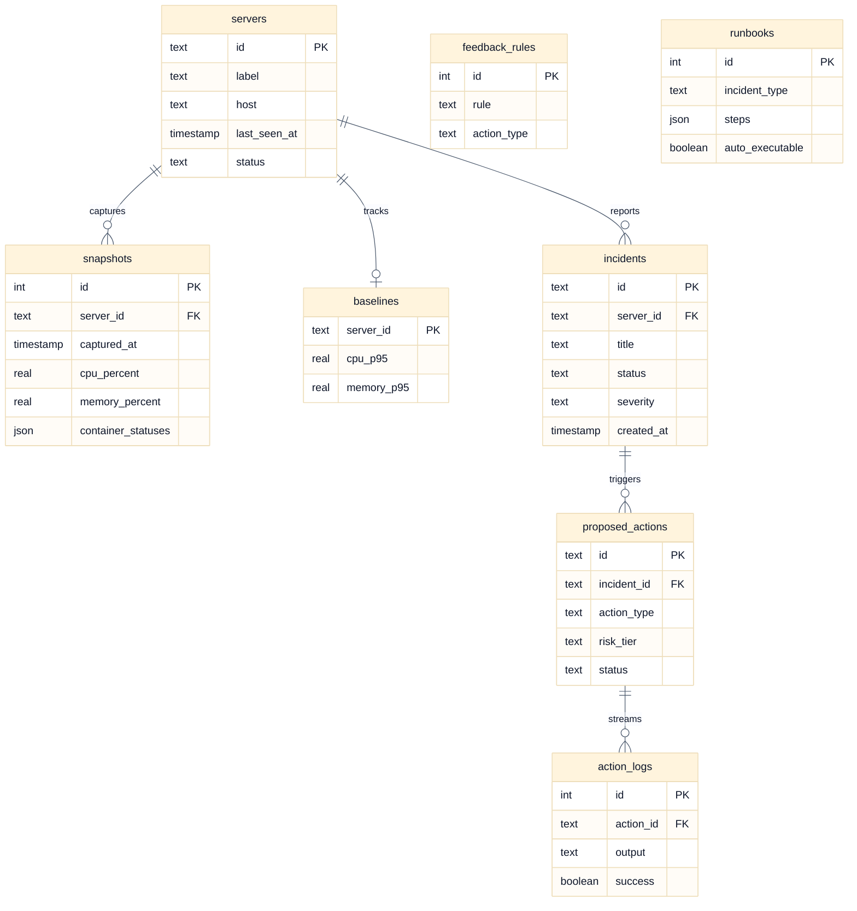

### SQL definition

```sql
-- Run automatically on startup via store.py

CREATE TABLE IF NOT EXISTS servers (
    id TEXT PRIMARY KEY,
    label TEXT NOT NULL,
    host TEXT NOT NULL,
    last_seen_at TIMESTAMP,
    status TEXT DEFAULT 'unknown'   -- healthy, degraded, critical, unknown
);

CREATE TABLE IF NOT EXISTS snapshots (
    id INTEGER PRIMARY KEY AUTOINCREMENT,
    server_id TEXT NOT NULL,
    captured_at TIMESTAMP DEFAULT CURRENT_TIMESTAMP,
    cpu_percent REAL,
    memory_percent REAL,
    disk_percent REAL,
    container_statuses JSON,        -- [{name, status, restart_count, image}]
    raw_data JSON
);

CREATE TABLE IF NOT EXISTS baselines (
    server_id TEXT PRIMARY KEY,
    cpu_p95 REAL,                   -- 95th percentile over last 24h
    memory_p95 REAL,
    updated_at TIMESTAMP DEFAULT CURRENT_TIMESTAMP
);

CREATE TABLE IF NOT EXISTS incidents (
    id TEXT PRIMARY KEY,            -- UUID
    server_id TEXT NOT NULL,
    service_name TEXT,
    title TEXT NOT NULL,
    description TEXT,
    root_cause TEXT,
    status TEXT DEFAULT 'open',     -- open, resolved, false_positive
    severity TEXT,                  -- low, medium, high, critical
    created_at TIMESTAMP DEFAULT CURRENT_TIMESTAMP,
    resolved_at TIMESTAMP,
    postmortem_draft TEXT
);

CREATE TABLE IF NOT EXISTS proposed_actions (
    id TEXT PRIMARY KEY,            -- UUID
    incident_id TEXT,
    action_type TEXT NOT NULL,      -- restart_container, rollback_deployment, etc.
    description TEXT NOT NULL,      -- human-readable: "Restart api-service on vps-01"
    rationale TEXT NOT NULL,        -- Claude's reasoning
    risk_tier TEXT NOT NULL,        -- low, medium, high
    rollback_plan TEXT NOT NULL,
    parameters JSON NOT NULL,       -- {host, service, command, ...}
    status TEXT DEFAULT 'pending',  -- pending, approved, rejected, executed, rolled_back
    created_at TIMESTAMP DEFAULT CURRENT_TIMESTAMP,
    reviewed_at TIMESTAMP,
    reviewer_feedback TEXT          -- stored if rejected — becomes a rule
);

CREATE TABLE IF NOT EXISTS action_logs (
    id INTEGER PRIMARY KEY AUTOINCREMENT,
    action_id TEXT NOT NULL,
    timestamp TIMESTAMP DEFAULT CURRENT_TIMESTAMP,
    output TEXT,                    -- live SSH/Docker output streamed here
    success BOOLEAN
);

CREATE TABLE IF NOT EXISTS feedback_rules (
    id INTEGER PRIMARY KEY AUTOINCREMENT,
    action_type TEXT NOT NULL,
    service_name TEXT,              -- NULL = applies to all services
    server_id TEXT,                 -- NULL = applies to all servers
    rule TEXT NOT NULL,             -- natural language rule Claude reads at planning time
    created_at TIMESTAMP DEFAULT CURRENT_TIMESTAMP,
    created_from_action_id TEXT     -- which rejected action created this rule
);

CREATE TABLE IF NOT EXISTS runbooks (
    id INTEGER PRIMARY KEY AUTOINCREMENT,
    incident_type TEXT NOT NULL,    -- e.g. "container_oom_killed"
    service_name TEXT,
    steps JSON NOT NULL,            -- [{step, command, expected_outcome}]
    auto_executable BOOLEAN DEFAULT FALSE,
    updated_at TIMESTAMP DEFAULT CURRENT_TIMESTAMP
);
```

---

## 7. MCP Tools — Full Specification

All tools are registered in `server.py` via `mcp_registry.py`. Implementations live in `tools/`. Every tool must:
- Return a typed dict (not a string)
- Include a `"success": bool` key
- Include an `"error": str | None` key
- Never raise exceptions — catch and return `{"success": false, "error": "..."}`

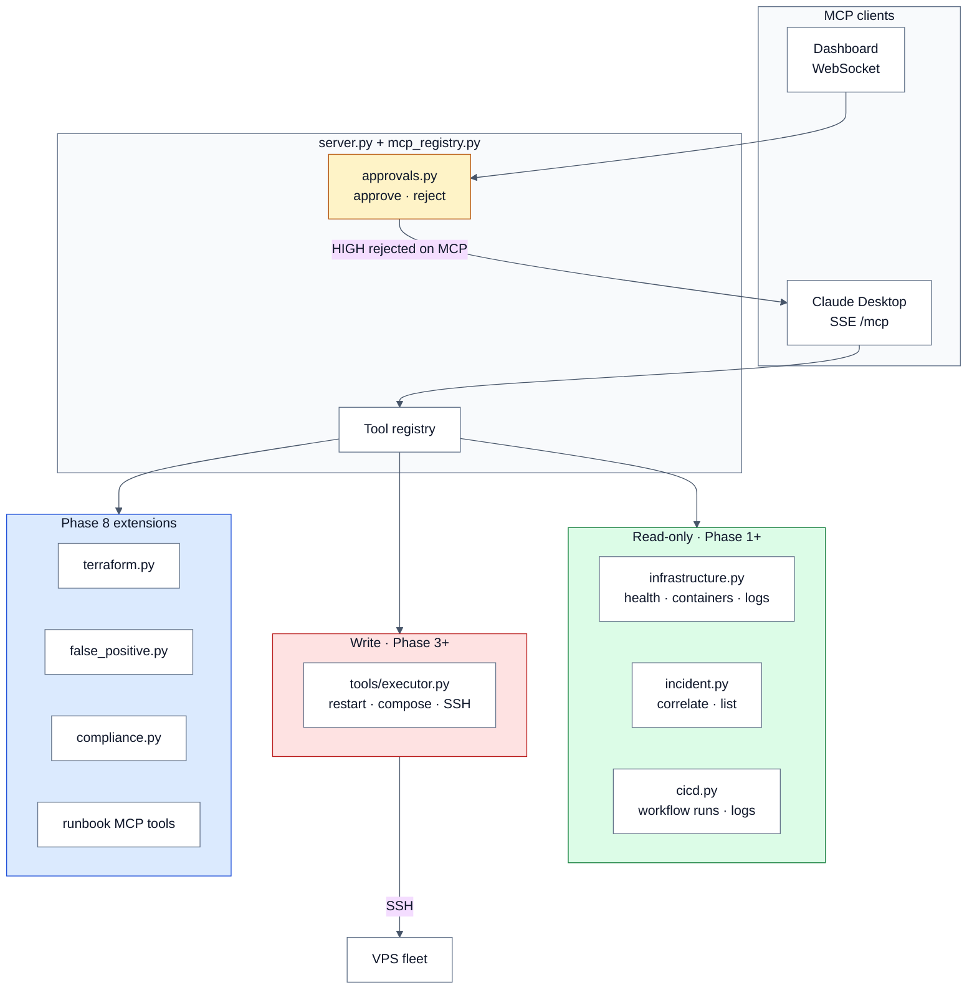

### 7.1 Infrastructure Tools (`tools/infrastructure.py`)

```python
@mcp.tool()
async def get_server_health(server_id: str) -> dict:
    """
    SSH into server and return current health snapshot.
    Runs: uptime, free -m, df -h, systemctl status docker
    Returns: {success, cpu_percent, memory_percent, disk_percent,
              load_average, uptime_seconds, docker_running}
    """

@mcp.tool()
async def list_containers(server_id: str) -> dict:
    """
    SSH and run: docker ps -a --format json
    Returns: {success, containers: [{name, status, image,
              restart_count, created_at, ports}]}
    """

@mcp.tool()
async def get_container_logs(server_id: str, container_name: str, tail: int = 100) -> dict:
    """
    SSH and run: docker logs --tail {tail} --timestamps {container_name}
    Returns: {success, logs: str, container_name, server_id}
    """

@mcp.tool()
async def get_docker_compose_status(server_id: str, compose_file: str) -> dict:
    """
    SSH and run: docker-compose -f {compose_file} ps
    Returns: {success, services: [{name, state, health}]}
    """

@mcp.tool()
async def check_disk_usage(server_id: str) -> dict:
    """
    SSH and run: df -h and du -sh /var/lib/docker
    Returns: {success, filesystems: [{mount, used_percent, available}],
              docker_size_gb: float}
    """

@mcp.tool()
async def get_recent_events(server_id: str, minutes: int = 30) -> dict:
    """
    SSH and run: journalctl --since "{minutes} minutes ago" --priority=err
    Returns: {success, events: [{timestamp, unit, message}]}
    """
```

### 7.2 Execution Tools (`tools/executor.py`)

**CRITICAL:** Every execution tool must:
1. Check `risk_tier` against config — reject if tier requires approval and `approved=False`
2. Snapshot state before executing (for rollback)
3. Stream output to WebSocket via `ws_broadcast()`
4. Run post-execution health check
5. Log everything to `action_logs` table

```python
@mcp.tool()
async def restart_container(
    server_id: str,
    container_name: str,
    action_id: str,
    approved: bool = False
) -> dict:
    """
    Risk tier: LOW (auto-executes if auto_execute_risk_tier=low in config)
    SSH and run: docker restart {container_name}
    Snapshots container state before restart.
    Returns: {success, output, pre_state, post_state}
    """

@mcp.tool()
async def run_compose_command(
    server_id: str,
    compose_file: str,
    command: str,       # e.g. "up -d api-service", "restart db"
    action_id: str,
    approved: bool = False
) -> dict:
    """
    Risk tier: MEDIUM (always requires approval)
    SSH and run: docker-compose -f {compose_file} {command}
    Returns: {success, output, exit_code}
    """

@mcp.tool()
async def rollback_deployment(
    server_id: str,
    service_name: str,
    compose_file: str,
    action_id: str,
    approved: bool = False
) -> dict:
    """
    Risk tier: MEDIUM
    Pulls previous image tag from docker-compose.yml git history,
    updates the compose file, and runs docker-compose up -d {service_name}.
    Returns: {success, previous_image, current_image, output}
    """

@mcp.tool()
async def run_ssh_command(
    server_id: str,
    command: str,
    action_id: str,
    approved: bool = False,
    risk_tier: str = "high"
) -> dict:
    """
    Risk tier: HIGH (requires typed CONFIRM in dashboard)
    Runs arbitrary SSH command. Only use when no specific tool exists.
    Returns: {success, stdout, stderr, exit_code}
    """

@mcp.tool()
async def scale_service(
    server_id: str,
    compose_file: str,
    service_name: str,
    replicas: int,
    action_id: str,
    approved: bool = False
) -> dict:
    """
    Risk tier: MEDIUM
    docker-compose -f {compose_file} up -d --scale {service_name}={replicas}
    Returns: {success, previous_replicas, new_replicas, output}
    """
```

### 7.3 CI/CD Tools (`tools/cicd.py`)

```python
@mcp.tool()
async def get_latest_workflow_run(repo: str, branch: str = "main") -> dict:
    """
    GitHub API: GET /repos/{owner}/{repo}/actions/runs?branch={branch}&per_page=1
    Returns: {success, run_id, status, conclusion, created_at,
              html_url, head_commit: {message, author, sha}}
    """

@mcp.tool()
async def get_failed_step_logs(repo: str, run_id: int) -> dict:
    """
    GitHub API: GET /repos/{owner}/{repo}/actions/runs/{run_id}/jobs
    Finds failed steps, downloads their logs.
    Returns: {success, failed_steps: [{name, conclusion, log_excerpt}]}
    """

@mcp.tool()
async def get_recent_commits(repo: str, n: int = 5) -> dict:
    """
    GitHub API: GET /repos/{owner}/{repo}/commits?per_page={n}
    Returns: {success, commits: [{sha, message, author, timestamp, files_changed}]}
    """

@mcp.tool()
async def get_deployment_diff(repo: str, base_sha: str, head_sha: str) -> dict:
    """
    GitHub API: GET /repos/{owner}/{repo}/compare/{base}...{head}
    Returns: {success, files_changed: [{filename, additions, deletions, patch}],
              total_changes: int}
    """

@mcp.tool()
async def trigger_workflow(
    repo: str,
    workflow_id: str,
    ref: str = "main",
    action_id: str = None,
    approved: bool = False
) -> dict:
    """
    Risk tier: MEDIUM
    GitHub API: POST /repos/{owner}/{repo}/actions/workflows/{workflow_id}/dispatches
    Returns: {success, workflow_id, triggered_at}
    """
```

### 7.4 Incident and Memory Tools (`tools/incident.py`)

```python
@mcp.tool()
async def create_incident(
    server_id: str,
    title: str,
    description: str,
    severity: str,
    service_name: str = None
) -> dict:
    """
    Creates incident record in SQLite.
    Returns: {success, incident_id, created_at}
    """

@mcp.tool()
async def draft_postmortem(incident_id: str) -> dict:
    """
    Reads full incident context from SQLite (snapshots, actions, logs, timeline).
    Calls Claude API to generate blameless postmortem markdown.
    Template sections: Timeline | Root Cause | Impact | What went well |
    What went wrong | Action items | Compliance impact (if sensitive service)
    Returns: {success, postmortem_markdown, incident_id}
    """

@mcp.tool()
async def get_oncall_handoff() -> dict:
    """
    Generates shift handoff summary from last 8 hours of data:
    open incidents, actions taken, pending approvals, known issues,
    GitHub Actions run status for all repos.
    Returns: {success, handoff_markdown, generated_at}
    """

@mcp.tool()
async def store_feedback_rule(
    action_type: str,
    rule: str,
    service_name: str = None,
    server_id: str = None,
    created_from_action_id: str = None
) -> dict:
    """
    Stores a natural-language rule derived from operator rejection feedback.
    Claude reads all relevant rules at planning time before proposing actions.
    Returns: {success, rule_id}
    """

@mcp.tool()
async def get_runbook(service_name: str, incident_type: str) -> dict:
    """
    Retrieves stored runbook for this service + incident_type combination.
    Returns: {success, found: bool, steps, auto_executable}
    """

@mcp.tool()
async def correlate_incident(
    server_id: str,
    service_name: str,
    minutes_back: int = 30
) -> dict:
    """
    The key intelligence tool. Gathers:
    - Recent snapshots showing the degradation timeline
    - GitHub Actions runs in the same timeframe
    - Recent commits to related repos
    - Similar past incidents from SQLite
    - Active feedback rules for this service
    Returns: {success, timeline, likely_cause, related_deploy,
              similar_incidents, rules_to_respect}
    """
```

---

## 8. The Agent Loop (`agent.py`)

This is the most important file. It implements the observe → analyse → plan → gate → execute → verify cycle.

```mermaid
%%{init: {'theme':'base', 'themeVariables': {'primaryTextColor':'#0f172a','secondaryTextColor':'#0f172a','tertiaryTextColor':'#0f172a','lineColor':'#475569','textColor':'#0f172a','clusterBkg':'#f8fafc','clusterBorder':'#64748b','titleColor':'#0f172a'}}}%%
flowchart LR
  O1["1 Observe<br/>poller snapshot"] --> O2["2 Detect<br/>anomaly event"]
  O2 --> O3["3 Analyse<br/>correlate_incident + rules"]
  O3 --> O4["4 Plan<br/>Claude one-shot JSON"]
  O4 --> O5["5 Gate<br/>pending action"]
  O5 --> O6["6 Execute<br/>executor SSH"]
  O6 --> O7["7 Verify<br/>health + postmortem"]

  O5 -.->|"60s still pending"| R["action_pending_reminder<br/>MCP nudge LOW/MEDIUM"]
  O5 -.->|"LOW auto"| A["skip gate if safe"]
  A --> O6

  style O1 fill:#dbeafe,stroke:#1d4ed8,color:#0f172a
  style O2 fill:#fef3c7,stroke:#b45309,color:#0f172a
  style O3 fill:#ede9fe,stroke:#6d28d9,color:#0f172a
  style O4 fill:#fce7f3,stroke:#be185d,color:#0f172a
  style O5 fill:#fee2e2,stroke:#b91c1c,color:#0f172a
  style O6 fill:#dcfce7,stroke:#15803d,color:#0f172a
  style O7 fill:#bbf7d0,stroke:#15803d,color:#0f172a
  style R fill:#ffedd5,stroke:#c2410c,color:#0f172a
  style A fill:#dcfce7,stroke:#15803d,color:#0f172a
```

```python
async def run_agent_loop(anomaly: AnomalyEvent):
    """
    Called by poller when anomaly detected.

    Step 1:  Create incident in SQLite
    Step 2:  Load feedback rules for this server/service
    Step 3:  Call correlate_incident to gather full context
    Step 4:  Call Claude API with full context + all rules (one-shot JSON)
    Step 5:  Write ProposedAction to DB with status=pending
    Step 6:  Broadcast to dashboard via WebSocket
    Step 7:  If LOW + auto_execute + safe → execute immediately
    Step 8:  Else schedule approval_timeout_seconds (60s) reminder
    Step 9:  On approval (dashboard or MCP for LOW/MEDIUM) → executor
    Step 10: HIGH → dashboard CONFIRM only; MCP approve rejected
    Step 11: On rejection → store_feedback_rule + dismiss incident
    Step 12: Post-execution → verify health, update incident, draft postmortem
    """
```

### Claude API call structure (inside agent.py)

```python
SYSTEM_PROMPT = """
You are an autonomous DevOps AI agent monitoring real infrastructure.
Your job is to:
1. Analyse the anomaly and gathered context
2. Identify root cause
3. Propose ONE specific remediation action
4. Assign a risk tier (low/medium/high) based on the risk_tier_rules below
5. Write a rollback plan
6. Respect ALL feedback_rules — never propose an action that violates them

Risk tier rules:
- low: restarting a single container, clearing logs, read-only operations
- medium: config changes, deploy rollbacks, scaling, triggering workflows
- high: arbitrary SSH commands, firewall changes, secret rotation, data operations

Output a JSON ProposedAction object. No prose outside the JSON.
"""

# Always include in the user message (Python pre-gathers — no Claude API tool loop):
# - anomaly description
# - correlate_incident() output
# - all relevant feedback_rules
# - last 5 snapshots for this server
# - recent GitHub Actions runs
```

---

## 9. WebSocket Protocol

All real-time communication uses a single WebSocket at `ws://localhost:8080/ws`. Messages are JSON with a `type` field. **No REST polling for live state** — `ws.js` singleton only.

```mermaid
%%{init: {'theme':'base', 'themeVariables': {'primaryTextColor':'#0f172a','secondaryTextColor':'#0f172a','tertiaryTextColor':'#0f172a','lineColor':'#475569','textColor':'#0f172a','clusterBkg':'#f8fafc','clusterBorder':'#64748b','titleColor':'#0f172a'}}}%%
flowchart LR
  subgraph ServerToClient["Server → dashboard"]
    S1["snapshot_update"]
    S2["incident_created"]
    S3["action_pending"]
    S4["action_pending_reminder"]
    S5["action_log_line"]
    S6["action_executed"]
    S7["action_rolled_back"]
    S8["incident_resolved"]
    S9["action_rejected"]
  end

  subgraph ClientToServer["Dashboard → server"]
    C1["approve_action<br/>+ confirm_text for HIGH"]
    C2["reject_action<br/>+ feedback"]
    C3["request_handoff"]
  end

  Hub["ws_hub.py"] --> ServerToClient
  ClientToServer --> Hub

  style ServerToClient fill:#dbeafe,stroke:#1d4ed8,color:#0f172a
  style ClientToServer fill:#dcfce7,stroke:#15803d,color:#0f172a
  style Hub fill:#4338ca,stroke:#312e81,color:#ffffff
  classDef evt fill:#ffffff,stroke:#64748b,color:#0f172a
  class S1,S2,S3,S4,S5,S6,S7,S8,S9,C1,C2,C3 evt
```

TypeScript reference:

```typescript
// Server to client (dashboard receives these)
{ type: "snapshot_update", server_id: string, data: ServerHealth }
{ type: "incident_created", incident: Incident }
{ type: "action_pending", action: ProposedAction }    // triggers ApprovalCard
{ type: "action_pending_reminder", action_id: string, message: string }
{ type: "action_executed", action_id: string, output: string }
{ type: "action_log_line", action_id: string, line: string }  // streaming output
{ type: "action_rolled_back", action_id: string, reason: string }
{ type: "incident_resolved", incident_id: string }

// Client to server (dashboard sends these)
{ type: "approve_action", action_id: string, confirm_text?: string, compliance_confirm_text?: string }
{ type: "reject_action", action_id: string, feedback: string }
{ type: "request_handoff" }
```

---

## 10. Dashboard Components

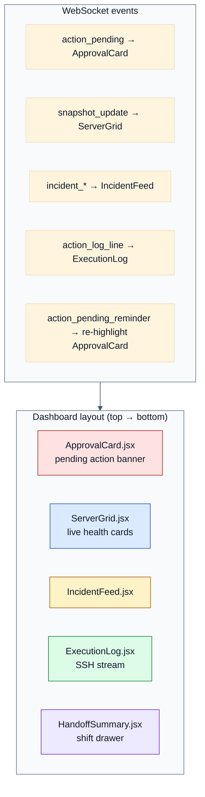

### `ServerGrid.jsx`
- One card per server defined in `config/servers.yaml`
- Each card shows: server label, status badge (healthy/degraded/critical), CPU%, memory%, disk%, container count
- Updates in real-time via WebSocket `snapshot_update` events
- Clicking a server card opens a detail panel showing individual containers

### `ApprovalCard.jsx`
- Full-width banner at top of dashboard when `action_pending` received
- Re-highlighted on `action_pending_reminder` (60s timeout)
- Shows: incident summary, proposed action (human-readable), risk tier badge (green/amber/red), Claude's rationale, rollback plan
- For HIGH risk: text input requiring operator to type "CONFIRM" before approve button activates
- Sensitive HIGH: also requires "COMPLIANCE" acknowledgment
- Buttons: "Approve" (green) and "Reject" (red, opens feedback textarea)
- Sends `approve_action` or `reject_action` to server via WebSocket
- **MCP cannot approve HIGH risk** — dashboard only

### `IncidentFeed.jsx`
- Chronological list of all incidents
- Each row: severity badge, title, server, service, timestamp, status
- Clicking opens incident detail: full timeline, actions taken, postmortem draft

### `ExecutionLog.jsx`
- Appears when an action is executing
- Streams `action_log_line` messages as terminal-style live output
- Shows "Rollback initiated" banner if rollback triggers

---

## 11. Build Phases

Build in this exact order. Each phase is independently demoable. Phases 5–9 extend the core (see `docs/PHASES_5_9_PLAN.md`).

```mermaid
%%{init: {'theme':'base', 'themeVariables': {'primaryTextColor':'#0f172a','secondaryTextColor':'#0f172a','tertiaryTextColor':'#0f172a','lineColor':'#475569','textColor':'#0f172a','clusterBkg':'#f8fafc','clusterBorder':'#64748b','titleColor':'#0f172a'}}}%%
flowchart LR
  P0["Phase 0<br/>Scaffold"] --> P1["Phase 1<br/>Poller + dashboard"]
  P1 --> P2["Phase 2<br/>Agent + approval gate"]
  P2 --> P3["Phase 3<br/>Execution + logs"]
  P3 --> P4["Phase 4<br/>GitHub + postmortem"]
  P4 --> P5["Phase 5–8<br/>Terraform · compliance · runbooks"]
  P5 --> P9["Phase 9<br/>Demo mode planned"]

  style P0 fill:#f1f5f9,stroke:#64748b,color:#0f172a
  style P1 fill:#dbeafe,stroke:#1d4ed8,color:#0f172a
  style P2 fill:#ede9fe,stroke:#6d28d9,color:#0f172a
  style P3 fill:#dcfce7,stroke:#15803d,color:#0f172a
  style P4 fill:#fef3c7,stroke:#b45309,color:#0f172a
  style P5 fill:#fce7f3,stroke:#be185d,color:#0f172a
  style P9 fill:#e2e8f0,stroke:#64748b,color:#0f172a
```

### Phase 1 — SSH health poller + basic dashboard

**Goal:** Dashboard shows live server health from your real VPS.

Files to build:
- `db/schema.sql` and `db/store.py`
- `models/server.py` and `models/config.py`
- `tools/infrastructure.py` (read-only tools only)
- `poller.py` (30s loop, writes snapshots to DB, no agent yet)
- `server.py` (FastAPI + WebSocket + static files, no MCP yet)
- `dashboard/src/components/ServerGrid.jsx`

**Done when:** Open `localhost:8080`, see live CPU/memory/disk and container list from your real VPS, updating every 30 seconds.

---

### Phase 2 — Claude analysis + approval gate

**Goal:** Claude detects an anomaly and the approval card appears in the dashboard.

Files to build:
- `agent.py` (Claude reasoning loop)
- `tools/incident.py` (create_incident, correlate_incident, store_feedback_rule)
- `dashboard/src/components/ApprovalCard.jsx`
- Wire: poller → agent → WebSocket → dashboard

**Done when:** Kill a Docker container on your VPS manually. Within 30 seconds, Claude detects it, proposes "restart container", approval card appears in the dashboard with rationale and risk tier.

---

### Phase 3 — Autonomous execution + rollback

**Goal:** Approved actions execute via SSH. Live output streams to dashboard. Rollback works.

Files to build:
- `tools/executor.py` (restart_container, run_compose_command, scale_service)
- `dashboard/src/components/ExecutionLog.jsx`
- Post-execution health check in `agent.py`
- Rollback logic in `executor.py`

**Done when:** Approve the restart action in the dashboard. Watch live `docker restart` output stream in. Container comes back up. Dashboard updates to healthy.

---

### Phase 4 — GitHub Actions + postmortem + memory

**Goal:** Full chain — deploy correlates to incident, RCA drafted, feedback stored.

Files to build:
- `tools/cicd.py` (all GitHub Actions tools)
- `tools/incident.py` (draft_postmortem, get_oncall_handoff, get_runbook)
- `dashboard/src/components/IncidentFeed.jsx`
- `dashboard/src/components/HandoffSummary.jsx`
- Wire: rejection feedback → store_feedback_rule

**Done when:** Trigger a bad deploy via GitHub Actions. Claude correlates the deploy to a container crash, proposes rollback, executes on approval, drafts full postmortem with timeline.

---

## 12. Dependencies

### Python (`pyproject.toml`)

```toml
[project]
name = "devops-agent"
version = "0.1.0"
requires-python = ">=3.11"

dependencies = [
    "mcp[cli]>=1.0.0",
    "fastapi>=0.111.0",
    "uvicorn[standard]>=0.29.0",
    "paramiko>=3.4.0",
    "PyGithub>=2.3.0",
    "aiosqlite>=0.20.0",
    "anthropic>=0.28.0",
    "pyyaml>=6.0",
    "python-dotenv>=1.0.0",
    "pydantic>=2.7.0",
    "httpx>=0.27.0",
]

[project.optional-dependencies]
dev = [
    "pytest>=8.0.0",
    "pytest-asyncio>=0.23.0",
    "responses>=0.25.0",
]
```

### Dashboard (`dashboard/package.json`)

```json
{
  "dependencies": {
    "react": "^18.3.0",
    "react-dom": "^18.3.0",
    "recharts": "^2.12.0"
  },
  "devDependencies": {
    "@vitejs/plugin-react": "^4.3.0",
    "vite": "^5.3.0",
    "tailwindcss": "^3.4.0",
    "autoprefixer": "^10.4.0"
  }
}
```

---

## 13. Running the Project

```bash
# Install Python dependencies
pip install -e ".[dev]"

# Build dashboard
cd dashboard && npm install && npm run build && cd ..

# Copy and fill in secrets
cp .env.example .env

# Fill in config/servers.yaml with your actual server details

# Start everything (single command)
python server.py

# Dashboard at: http://localhost:8080
```

### Claude Desktop config (chat fallback)

Copy `claude_desktop_config.json` to:
- macOS: `~/Library/Application Support/Claude/claude_desktop_config.json`
- Windows: `%APPDATA%\Claude\claude_desktop_config.json`

```json
{
  "mcpServers": {
    "devops-agent": {
      "command": "python",
      "args": ["/absolute/path/to/devops-agent/server.py"],
      "env": {
        "ANTHROPIC_API_KEY": "your-key-here"
      }
    }
  }
}
```

---

## 14. Key Design Decisions — Do Not Change Without Discussion

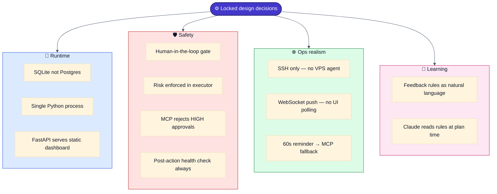

| Decision | Reason |
|---|---|
| SQLite not Postgres | Zero infrastructure — anyone clones and runs immediately |
| SSH only, no server agent | Realistic constraint — most VPS do not have monitoring agents installed |
| Single Python process | One command starts everything — no docker-compose to manage the manager |
| Feedback rules as natural language | Claude reads them at planning time — no regex or rule engine needed |
| Risk tiers enforced at executor level | Even if agent proposes wrong tier, executor enforces the gate |
| MCP rejects HIGH risk approvals | Arbitrary SSH requires dashboard CONFIRM — not chat shortcut |
| WebSocket for all real-time | No polling from dashboard — server pushes all state changes |
| FastAPI serves dashboard static files | No CORS issues, no separate frontend server, single origin |
| Post-action health check always runs | Executor never assumes success — always verifies before closing action |
| Approval timeout triggers MCP reminder | Dashboard might not be open — Claude Desktop is the safety net (LOW/MEDIUM only) |

---

## 15. README Structure (for GitHub showcase)

The README must tell the story a hiring manager reads in under 2 minutes.

1. **What this is** — one paragraph, no jargon
2. **Demo GIF** — screen recording: container crash → Claude detects → approval card → approve → live output → resolved
3. **Architecture diagrams** — Mermaid diagrams from Section 3 (topology, layers, approval flow, risk tiers)
4. **How it works** — the 7-step agent loop in plain English
5. **Setup** — exactly the commands from Section 13
6. **The approval gate** — three risk tiers; HIGH dashboard-only + CONFIRM; MCP fallback for LOW/MEDIUM after 60s
7. **Tech stack** — table of every library and why it was chosen
8. **What I built and learned** — 3–4 sentences on MCP tool design, async Python, human-in-the-loop AI patterns

---

*End of specification. Build Phase 1 first. Ask before deviating from any architectural decision above.*