# DevOps MCP — Multi-site fleet control

**DevOps MCP** is a local-first control plane for agencies and indie hackers managing **5–20 client sites** on Docker Compose VPS hosts. One dashboard shows **live uptime**, per-site HTTP latency, container logs, and restart actions across your fleet—no agent installed on servers, only SSH.

The same runtime still includes the original **AI DevOps agent** (Phases 0–8): SSH poller, Claude planning, risk-gated execution, and MCP tools for investigation. The **product UI** is now **fleet-first**; advanced agent/Terraform/runbook features stay in the codebase but are not the primary nav.

> **Status:** Fleet product v2 shipped (onboarding, sites, live uptime, fleet table UI). Core agent Phases 0–8 complete. **Production deploy** (`devopsmcp.nevil.ca`) still needs HTTPS, auth, and Slack delivery — see [Product status](#product-status) below.  
> **Original spec:** [Project.md](Project.md) · **Decisions:** [docs/DECISIONS.md](docs/DECISIONS.md)

---

## Why we pivoted

This repo started as a **portfolio-grade autonomous DevOps agent** demo: poller → Claude → approval gate → SSH execute, with Terraform UI, compliance typing, runbooks, and Claude Desktop as a first-class approval channel.

That architecture is strong engineering, but it is **not what operators with many small client VPS sites reach for daily**. Feedback and real use pointed to a simpler job:

| Old focus | Problem |
|-----------|---------|
| Server-centric grid + incident feed | Hard to see **which client site** is down at a glance |
| YAML-first onboarding | High friction vs “paste SSH key, add URL” |
| Terraform / compliance / runbooks in main nav | Impressive for demos, **noise** for 5–20 Compose sites |
| Claude Desktop as approval path | Wrong default for a **web product** |

**Pivot (2026):** **Site-first fleet product** — connect VPS over SSH, register client sites with URLs, get **automatic uptime checks every 60s** with WebSocket live updates, inline check/restart/logs, optional AI remediation behind the existing approval gate. MCP remains for **investigation** (logs, incidents), not as the main UI.

We kept the agent, executor, and MCP layer; we **cut/hid** portfolio theater from the default experience and invested in onboarding + live fleet visibility.

---

## What you get today (Fleet)

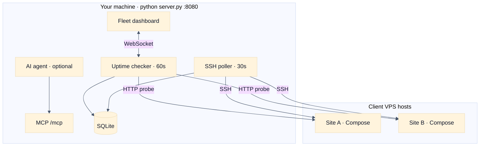

| Feature | Status |
|---------|--------|
| SSH server onboarding (key path or upload) | ✅ |
| Add client sites (URL, container, optional compose path) | ✅ |
| Live uptime (60s) + WebSocket `site_update` | ✅ |
| Fleet table: status, HTTP, latency, last check | ✅ |
| Per-site check / check-all / restart / logs | ✅ |
| Connected servers panel | ✅ |
| Alerts tab (down sites + pending AI approvals) | ✅ |
| Incidents history | ✅ |
| Settings (Slack webhook + email **stored**) | ⚠️ stored only — not sent yet |
| AI auto-remediation | ⚠️ needs `ANTHROPIC_API_KEY` in `.env` |
| GitHub deploy correlation | ⚠️ needs `GITHUB_TOKEN` + `repos.yaml` |
| HTTPS + login for public deploy | ❌ not yet |
| Slack/email on downtime | ❌ not yet |

---

## How it works

### Fleet loop (primary)

1. **Connect** — Add VPS via SSH (UI wizard or legacy `config/servers.yaml`).
2. **Register sites** — Client name, URL, server, container name (compose path optional).
3. **Monitor** — Uptime checker probes URLs every **60s**; dashboard updates live via WebSocket.
4. **Act** — Restart containers, tail logs, manual re-check from the fleet table.
5. **Alert** — Down sites surface in the fleet banner and **Alerts** tab; AI approvals appear when the agent proposes fixes.

### Agent loop (optional, unchanged)

1. **Observe** — Poller SSHes each VPS every 30s; metrics and containers → SQLite.
2. **Detect** — Threshold / baseline anomaly → incident.
3. **Plan** — Claude one-shot JSON `ProposedAction` (Python pre-gathers context).
4. **Gate** — Dashboard approval; LOW may auto-execute; HIGH requires typed `CONFIRM`.
5. **Execute & verify** — Risk-gated SSH, live logs, post-action health check.

---

## High-level architecture

Single process on **`127.0.0.1:8080`** — `python server.py` runs FastAPI, WebSocket, MCP (SSE), the 30s poller, and serves the React build. No agent on VPS; all remote access is SSH + GitHub API.

### Deployment topology

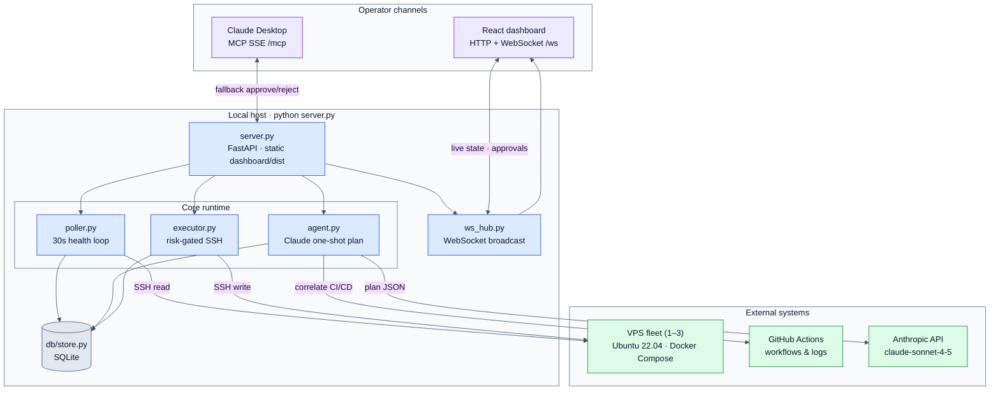

### System context

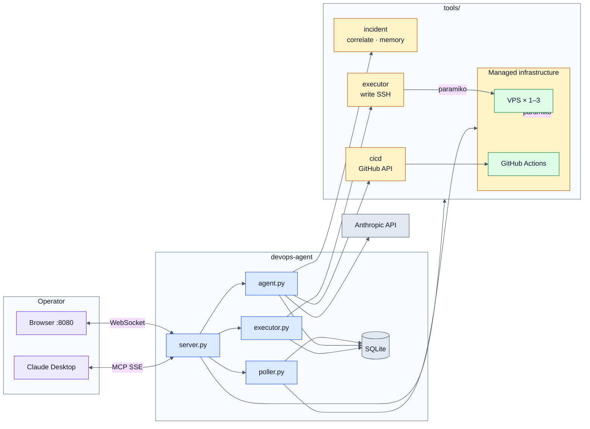

---

## System design

### Layered architecture

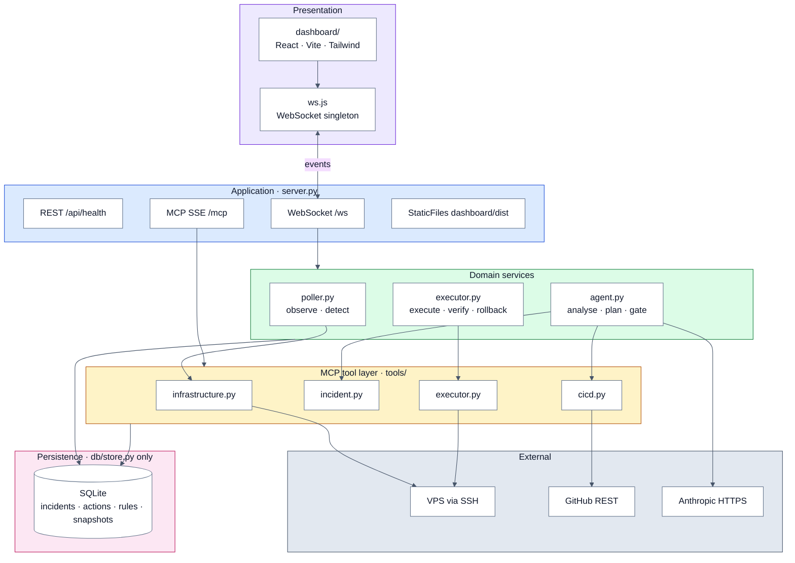

### Design constraints

```mermaid
%%{init: {'theme':'base', 'themeVariables': {'primaryTextColor':'#0f172a','secondaryTextColor':'#0f172a','tertiaryTextColor':'#0f172a','lineColor':'#475569','textColor':'#0f172a','clusterBkg':'#f8fafc','clusterBorder':'#64748b','titleColor':'#0f172a'}}}%%
flowchart TB
  ROOT(["⚙️ Design constraints"])

  subgraph RUN["🚀 Runtime"]
    direction TB
    R1["Single process · python server.py"]
    R2["Bind 127.0.0.1:8080"]
    R3["No message broker"]
  end

  subgraph SAF["🛡️ Safety"]
    direction TB
    S1["Human-in-the-loop approval gate"]
    S2["Risk enforced in executor.py"]
    S3["Max 1 pending action / server"]
    S4["protected_services block writes"]
  end

  subgraph OPS["🌐 Remote ops"]
    direction TB
    O1["SSH only · paramiko"]
    O2["No daemon on VPS"]
    O3["10s timeout · pooled connections"]
  end

  subgraph DAT["💾 Data"]
    direction TB
    D1["SQLite via store.py only"]
    D2["UTC in DB · local in UI"]
    D3["Snapshots pruned after 7d"]
  end

  subgraph MCP["🔌 MCP contract"]
    direction TB
    M1["Return success + error"]
    M2["Never raise to caller"]
    M3["Claude Desktop via SSE"]
    M4["MCP rejects HIGH risk approvals"]
  end

  subgraph LRN["🧠 Learning"]
    direction TB
    L1["Rejections → feedback_rules"]
    L2["Claude respects on replan"]
  end

  ROOT --> RUN & SAF & OPS & DAT & MCP & LRN

  style ROOT fill:#4338ca,stroke:#312e81,color:#ffffff,stroke-width:2px
  style RUN fill:#dbeafe,stroke:#1d4ed8,color:#0f172a
  style SAF fill:#fee2e2,stroke:#b91c1c,color:#0f172a
  style OPS fill:#dcfce7,stroke:#15803d,color:#0f172a
  style DAT fill:#fef3c7,stroke:#b45309,color:#0f172a
  style MCP fill:#ede9fe,stroke:#6d28d9,color:#0f172a
  style LRN fill:#fce7f3,stroke:#be185d,color:#0f172a
  style R1 fill:#bfdbfe,stroke:#1d4ed8,color:#0f172a
  style R2 fill:#bfdbfe,stroke:#1d4ed8,color:#0f172a
  style R3 fill:#bfdbfe,stroke:#1d4ed8,color:#0f172a
  style S1 fill:#fecaca,stroke:#b91c1c,color:#0f172a
  style S2 fill:#fecaca,stroke:#b91c1c,color:#0f172a
  style S3 fill:#fecaca,stroke:#b91c1c,color:#0f172a
  style S4 fill:#fecaca,stroke:#b91c1c,color:#0f172a
  style O1 fill:#bbf7d0,stroke:#15803d,color:#0f172a
  style O2 fill:#bbf7d0,stroke:#15803d,color:#0f172a
  style O3 fill:#bbf7d0,stroke:#15803d,color:#0f172a
  style D1 fill:#fde68a,stroke:#b45309,color:#0f172a
  style D2 fill:#fde68a,stroke:#b45309,color:#0f172a
  style D3 fill:#fde68a,stroke:#b45309,color:#0f172a
  style M1 fill:#ddd6fe,stroke:#6d28d9,color:#0f172a
  style M2 fill:#ddd6fe,stroke:#6d28d9,color:#0f172a
  style M3 fill:#ddd6fe,stroke:#6d28d9,color:#0f172a
  style M4 fill:#ddd6fe,stroke:#6d28d9,color:#0f172a
  style L1 fill:#fbcfe8,stroke:#be185d,color:#0f172a
  style L2 fill:#fbcfe8,stroke:#be185d,color:#0f172a
```

### Component map

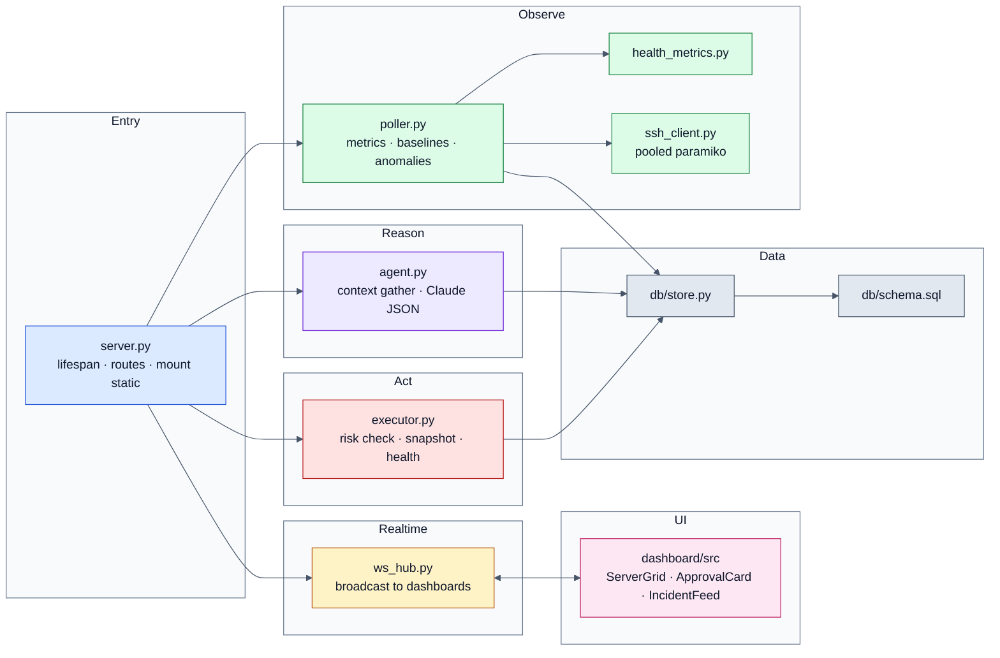

### Data model

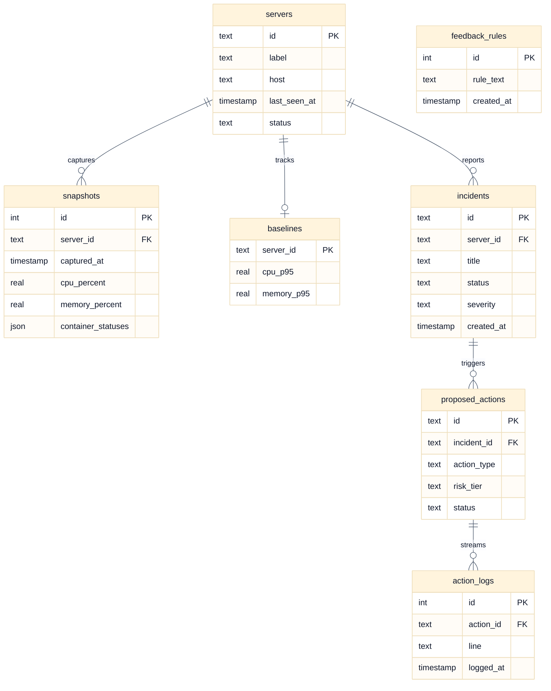

Full schema: [`db/schema.sql`](db/schema.sql).

### End-to-end data flow

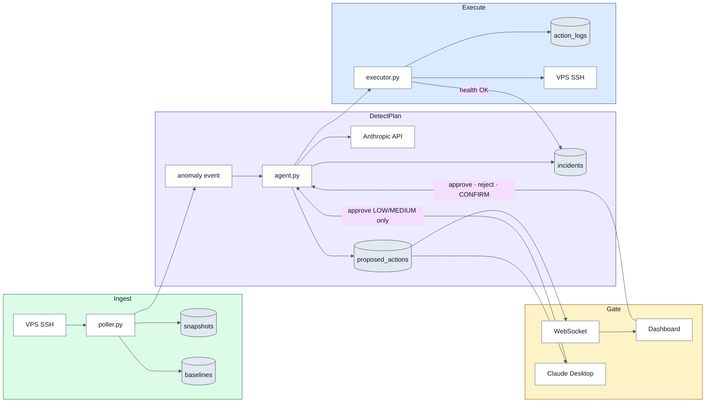

### Approval & risk flow

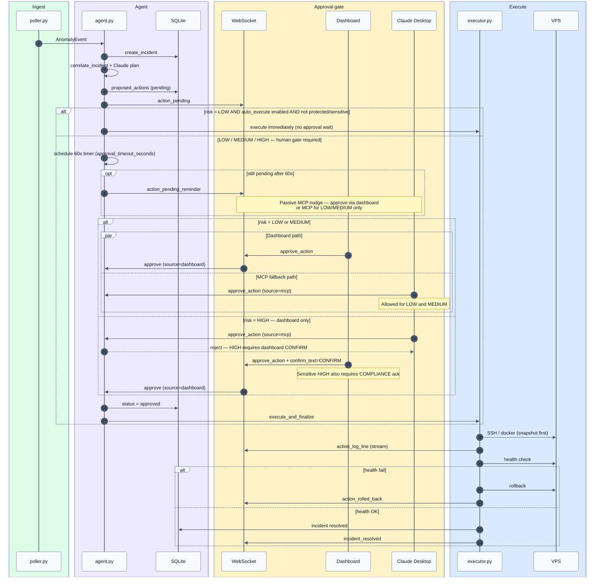

### Risk tiers

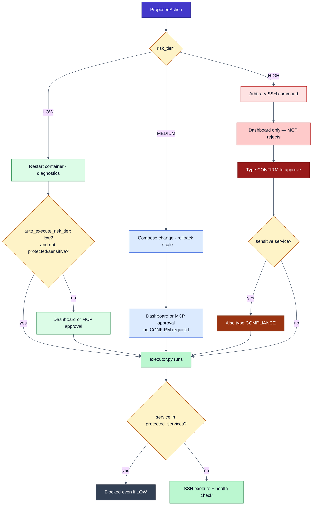

### WebSocket protocol

```mermaid
%%{init: {'theme':'base', 'themeVariables': {'primaryTextColor':'#0f172a','secondaryTextColor':'#0f172a','tertiaryTextColor':'#0f172a','lineColor':'#475569','textColor':'#0f172a','clusterBkg':'#f8fafc','clusterBorder':'#64748b','titleColor':'#0f172a'}}}%%
flowchart LR
  subgraph ServerToClient["Server → client"]
    S1["snapshot_update<br/>live metrics"]
    S2["incident_created"]
    S3["action_pending<br/>approval card"]
    S4["action_log_line<br/>SSH stream"]
    S5["action_executed"]
    S6["action_rolled_back"]
    S7["incident_resolved"]
    S8["action_pending_reminder<br/>after 60s"]
  end

  subgraph ClientToServer["Client → server"]
    C1["approve_action"]
    C2["reject_action"]
    C3["request_handoff<br/>Phase 4"]
  end

  Hub["ws_hub.py"] --> ServerToClient
  ClientToServer --> Hub

  style ServerToClient fill:#dbeafe,stroke:#1d4ed8,color:#0f172a
  style ClientToServer fill:#dcfce7,stroke:#15803d,color:#0f172a
  style Hub fill:#4338ca,stroke:#312e81,color:#ffffff
  classDef evt fill:#ffffff,stroke:#64748b,color:#0f172a
  class S1,S2,S3,S4,S5,S6,S7,S8,C1,C2,C3 evt
```

### External integrations

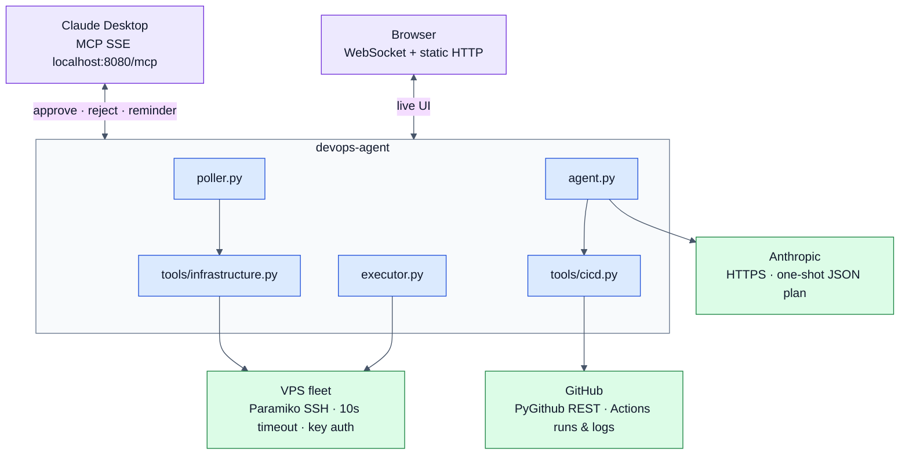

---

## The approval gate

| Tier | Examples | Default behavior |
|------|----------|------------------|
| **Low** | Restart one container, read-only diagnostics | May auto-execute if `auto_execute_risk_tier: low` in `config/rules.yaml` (not on protected/sensitive services) |
| **Medium** | Compose changes, rollback deploy, scale, trigger workflow | Always requires approval — dashboard **or** MCP |
| **High** | Arbitrary SSH | **Dashboard only** — type **CONFIRM**; MCP `approve_action` is rejected |

Executor enforces tiers even if the model mis-labels risk. Rejections become natural-language **feedback rules** Claude must respect on future plans.

---

## Tech stack

| Layer | Choice | Why |
|-------|--------|-----|
| Agent runtime | Python 3.11+ | Async SSH, MCP, FastAPI ecosystem |
| API / realtime | FastAPI + WebSocket | Single origin with static dashboard |
| Protocol | MCP | Claude Desktop + tool standardization |
| LLM | Anthropic API | Planning, postmortem, handoff |
| Remote access | Paramiko (SSH) | No agent on VPS—realistic ops constraint |
| CI/CD data | PyGithub | Actions runs, logs, diffs |
| State | SQLite (aiosqlite) | Zero extra infrastructure |
| UI | React 18 + Vite + Tailwind | Fast dashboard, served as static build |
| Charts | Recharts | Server metric trends (Phase 4+) |

---

## Project structure

```
devops-mcp/
├── server.py              # Entry: FastAPI + MCP + WebSocket + static
├── fleet_routes.py        # Fleet API: servers, sites, settings
├── fleet_sync.py          # DB ↔ servers.yaml sync
├── onboarding.py          # SSH test, compose discovery, containers
├── uptime_checker.py      # HTTP uptime every 60s
├── poller.py              # 30s SSH health loop
├── agent.py               # Claude observe→plan→gate loop
├── executor.py            # Risk-gated execution orchestration
├── tools/                 # MCP tool implementations
├── db/                    # schema.sql + store.py (only DB access)
├── dashboard/             # React SPA → dist/ (Fleet UI)
├── config/                # servers.yaml, rules.yaml, repos.yaml (gitignored)
└── tests/                 # 60 tests, mocked SSH/GitHub
```

Full original layout: [Project.md](Project.md#4-complete-file-structure).

---

## Product status

Verified locally (2026-06-29):

| Check | Result |
|-------|--------|
| `pytest tests/` | **60 passed** |
| `npm run build` (dashboard) | ✅ |
| `GET /api/fleet/overview` | ✅ sites/servers stats |
| `GET /api/setup/status` | ✅ `product: fleet` |
| Uptime checker + WS `site_update` | ✅ |
| Fleet UI (table, check all, logs) | ✅ |

**Known gaps (planned, not blockers for local use):**

- **Slack/email alerts** — webhook saved in Settings; sender not wired to uptime transitions.
- **Public deploy** — no reverse proxy, TLS, or login yet (`devopsmcp.nevil.ca`).
- **AI features** — optional; require real Anthropic + GitHub tokens in `.env`.
- **Legacy UI pages** — Terraform, Runbooks, old Dashboard still in repo; hidden from main nav.
- **Servers without Docker** — poller errors (e.g. `docker: command not found`); uptime still works if URL is set.

---

## Setup

**Prerequisites:** Python 3.11+, Node 18+, SSH key access to at least one VPS.

```bash
git clone https://github.com/NevilPatel01/DevOpsAI
cd DevOpsAI

python3.11 -m venv .venv
source .venv/bin/activate
pip install -e ".[dev]"

cd dashboard && npm install && npm run build && cd ..

cp .env.example .env
cp config/repos.yaml.example config/repos.yaml   # optional — for GitHub correlation

python server.py
# → http://127.0.0.1:8080
```

### First run (UI — recommended)

1. Open **http://127.0.0.1:8080** → **Fleet** tab.
2. **Add server** — host, SSH user, key path or upload private key; test connection.
3. **Add site** — client name, URL, pick server, container name (compose path optional).
4. Watch the fleet table — status, HTTP code, latency, and last check update every **60s** (live via WebSocket).

### Legacy YAML path (optional)

```bash
cp config/servers.yaml.example config/servers.yaml
# Edit hosts — imported into DB on first start if DB is empty
```

Set `ANTHROPIC_API_KEY` and `GITHUB_TOKEN` in `.env` when you want AI remediation and deploy correlation.

### Setup checklist

Before relying on the agent, confirm each item:

| Step | Command / action |
|------|------------------|
| Env | `cp .env.example .env` — optional keys for AI/GitHub |
| Dashboard | `cd dashboard && npm install && npm run build` |
| Server | `python server.py` (venv active) |
| Health | `curl -s http://127.0.0.1:8080/api/health` |
| Fleet | `curl -s http://127.0.0.1:8080/api/fleet/overview` |
| Setup | `curl -s http://127.0.0.1:8080/api/setup/status` — `servers_in_db`, `sites_count`, `product: fleet` |

The Fleet page shows a **setup banner** when servers or sites are missing.

**Claude Desktop / Cursor MCP:** connect to `http://127.0.0.1:8080/mcp` (SSE) while `python server.py` is running — see `claude_desktop_config.json`.

---

## Development

Phased build order: **[docs/DEVELOPMENT_PLAN.md](docs/DEVELOPMENT_PLAN.md)** (summary) and **[Project.md §11](Project.md#11-build-phases)** (full spec). Phase 6 decisions: **[docs/DECISIONS.md](docs/DECISIONS.md)**.

### Tests (no VPS required)

```bash
source .venv/bin/activate
pip install -e ".[dev]"
pytest tests/ -v
ruff check .
```

CI runs the same on Python 3.11 with mocked SSH/GitHub. Optional local integration test: copy `config/servers.yaml.example` → `config/servers.yaml` and fill real hosts (`test_servers_config_loads` skips if missing).

Cursor workflow: `.cursor/rules/` and `.cursor/commands/`.

---

## What I built & learned

- **Product pivot:** Optimizing for **daily fleet ops** (uptime, logs, restart) beat showcasing every agent feature in the main nav.
- **Site-first data model:** `sites` + `managed_servers` in SQLite with YAML sync for the legacy poller.
- **Live UX:** WebSocket `site_update` beats polling; fleet table shows everything without drilling into drawers.
- **MCP tool design:** Consistent `{success, error}` contracts; MCP for investigation, dashboard for actions.
- **Human-in-the-loop AI:** Risk tiers enforced in `executor.py`, not only in prompts.
- **Ops realism:** SSH-only on VPS — no daemon on client servers.

### Works offline vs needs your VPS

| Works without VPS | Needs real infrastructure |
|-------------------|---------------------------|
| `pytest`, `ruff`, dashboard `npm run build` | `python server.py` poller + live metrics |
| MCP tool handlers (mocked in tests) | SSH in `config/servers.yaml` |
| Dashboard UI against empty DB | Kill/restart demo on `test-nginx` |
| Claude planning (with `ANTHROPIC_API_KEY`) | GitHub correlation (`GITHUB_TOKEN`, `repos.yaml`) |

---

## License

MIT — see [LICENSE](LICENSE).

---

## References

- [Project specification](Project.md)
- [Development plan](docs/DEVELOPMENT_PLAN.md)
- [Architecture decisions](docs/DECISIONS.md)
