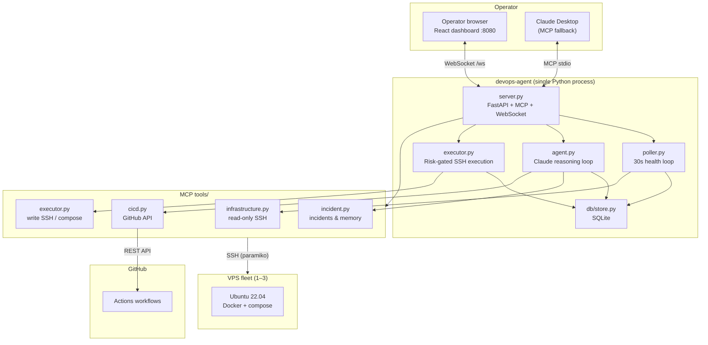
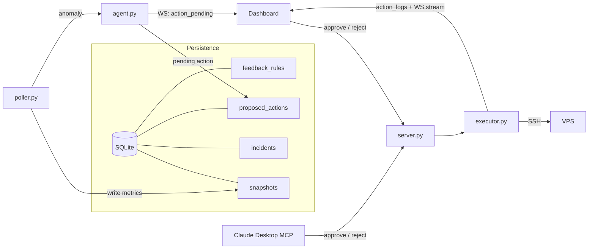
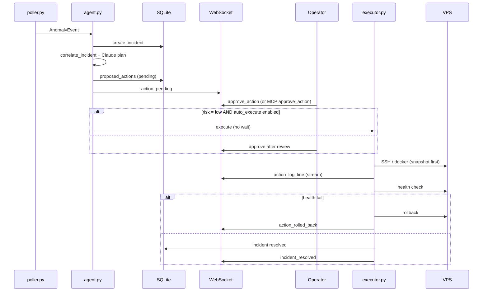

# DevOps AI Agent

An autonomous **DevOps AI agent** that monitors real VPS infrastructure over SSH, reasons about anomalies with Claude, proposes remediations, and executes fixes behind a **human-in-the-loop approval gate**. Built on the [Model Context Protocol (MCP)](https://modelcontextprotocol.io), with a real-time React dashboard and Claude Desktop as a fallback approval channel.

> **Status:** Phase 4 complete — GitHub correlation, rollback, postmortem, handoff, sparklines.  
> **Spec:** [Project.md](Project.md) (build phases in §11).

<!-- Record a screen capture (container crash → approval → live output → resolved) and save as docs/assets/demo.gif, then uncomment: -->
<!--  -->

---

## What this is

Most monitoring tools alert on thresholds. This project closes the loop: Claude **correlates** signals (e.g. container crash + recent GitHub Actions deploy), **proposes** a single remediation with risk tier and rollback plan, waits for **your approval** (web UI or Claude Desktop), then **executes** over SSH and **verifies** health—with full audit logs and **learned rules** from past rejections.

---

## How it works (agent loop)

1. **Observe** — Poller SSHes each VPS every 30s; metrics and container state go to SQLite; baselines updated.
2. **Detect** — Thresholds and baseline deviation raise an anomaly.
3. **Analyse** — Agent loads feedback rules, runs `correlate_incident` (snapshots, CI/CD, history).
4. **Plan** — Claude returns one structured `ProposedAction` (action, rationale, risk, rollback).
5. **Gate** — Pending action on dashboard; LOW-risk safe fixes auto-execute; after 60s, MCP + reminder if still pending (HIGH requires dashboard `CONFIRM`).
6. **Execute** — Approved actions run through risk-gated executor with live log streaming.
7. **Verify** — Post-action health check; auto-rollback on failure; postmortem when resolved.

---

## Architecture

### System context



### Component responsibilities



### Approval & risk flow



### Real-time WebSocket protocol

| Direction | `type` | Purpose |
|-----------|--------|---------|
| Server → client | `snapshot_update` | Live server metrics |
| Server → client | `incident_created` | New incident |
| Server → client | `action_pending` | Show approval card |
| Server → client | `action_log_line` | Stream SSH output |
| Server → client | `action_executed` / `action_rolled_back` | Execution outcome |
| Server → client | `incident_resolved` | Close incident |
| Client → server | `approve_action` / `reject_action` | Human gate |
| Client → server | `request_handoff` | Shift summary (Phase 4) |

---

## The approval gate

| Tier | Examples | Default behavior |
|------|----------|------------------|
| **Low** | Restart one container, read-only diagnostics | May auto-execute if `auto_execute_risk_tier: low` in `config/rules.yaml` |
| **Medium** | Compose changes, rollback deploy, scale, trigger workflow | Always requires approval |
| **High** | Arbitrary SSH | Approval + type **CONFIRM** in dashboard |

Executor enforces tiers even if the model mis-labels risk. Rejections become natural-language **feedback rules** Claude must respect on future plans.

---

## Tech stack

| Layer | Choice | Why |
|-------|--------|-----|
| Agent runtime | Python 3.11+ | Async SSH, MCP, FastAPI ecosystem |
| API / realtime | FastAPI + WebSocket | Single origin with static dashboard |
| Protocol | MCP | Claude Desktop + tool standardization |
| LLM | Anthropic API | Planning, postmortem, handoff |
| Remote access | Paramiko (SSH) | No agent on VPS—realistic ops constraint |
| CI/CD data | PyGithub | Actions runs, logs, diffs |
| State | SQLite (aiosqlite) | Zero extra infrastructure |
| UI | React 18 + Vite + Tailwind | Fast dashboard, served as static build |
| Charts | Recharts | Server metric trends (Phase 4+) |

---

## Project structure

```
devops-agent/
├── server.py              # Entry: FastAPI + MCP + WebSocket + static
├── poller.py              # 30s health loop
├── agent.py               # Claude observe→plan→gate loop
├── executor.py            # Risk-gated execution orchestration
├── tools/                 # MCP tool implementations
├── db/                    # schema.sql + store.py (only DB access)
├── models/                # Dataclasses / config models
├── dashboard/             # React SPA → dist/
├── config/
│   ├── servers.yaml
│   ├── rules.yaml
│   └── repos.yaml         # Multi-repo CI/CD (your config)
└── tests/
```

Full layout: [Project.md](Project.md#4-complete-file-structure).

---

## Setup

**Prerequisites:** Python 3.11+, Node 18+, SSH key access to VPS, Anthropic + GitHub tokens.

```bash
git clone <your-repo-url>
cd DevOpsAI

# Python 3.11+ (use 3.11 venv — 3.14 lacks pydantic wheels)
python3.11 -m venv .venv
source .venv/bin/activate
pip install -e ".[dev]"

# Dashboard
cd dashboard && npm install && npm run build && cd ..

# Config (servers.yaml and repos.yaml are gitignored)
cp .env.example .env
cp config/servers.yaml.example config/servers.yaml
cp config/repos.yaml.example config/repos.yaml
# Edit servers.yaml (SSH hosts) and repos.yaml (GitHub owner/name + linked_servers)

# Run
python server.py
# → http://127.0.0.1:8080
```

### Setup checklist

Before relying on the agent, confirm each item:

| Step | Command / action |
|------|------------------|
| Repos | `cp config/repos.yaml.example config/repos.yaml` — edit owner/name and `linked_servers` |
| Env | `cp .env.example .env` — set `ANTHROPIC_API_KEY`, `GITHUB_TOKEN`, optional `DATABASE_PATH` |
| Servers | `cp config/servers.yaml.example config/servers.yaml` — SSH hosts and services |
| Dashboard | `cd dashboard && npm install && npm run build` |
| Server | `python server.py` (from repo root with venv active) |
| Health | `curl -s http://127.0.0.1:8080/api/health` → `{"status":"ok",...}` |
| Setup | `curl -s http://127.0.0.1:8080/api/setup/status` — all flags should be true when ready |

The Overview page shows a **Setup checklist** banner when anything is missing (dismissible while incomplete).

**Handoff shortcut:** on the dashboard, press **H** to open the oncall handoff drawer (or use **Generate handoff** in the header).

**Claude Desktop (approval fallback):** copy `claude_desktop_config.json` to your Claude Desktop config and set the absolute path to `server.py`.

---

## Development

Phased build order and feature checklist: **[Project.md §11](Project.md#11-build-phases)** and **`.cursor/rules/phases.mdc`**.

Cursor workflow:

- Rules: `.cursor/rules/` (architecture, Python, dashboard, phases)
- Commands: `.cursor/commands/` (e.g. **Phase 1 — Start**)

---

## What I built & learned

*Update after implementation.*

- **MCP tool design:** Consistent `{success, error}` contracts and shared approval handlers for dashboard + Claude Desktop.
- **Async Python:** Poller, agent, and WebSocket in one process without blocking SSH.
- **Human-in-the-loop AI:** Risk tiers enforced at execution time, not only in prompts; rejections become durable natural-language rules.
- **Ops realism:** SSH-only monitoring—no daemon on managed servers—mirrors how small teams run VPS today.

---

## License

MIT — see [LICENSE](LICENSE).

---

## References

- [Project specification](Project.md)
- [Development plan](docs/DEVELOPMENT_PLAN.md)
